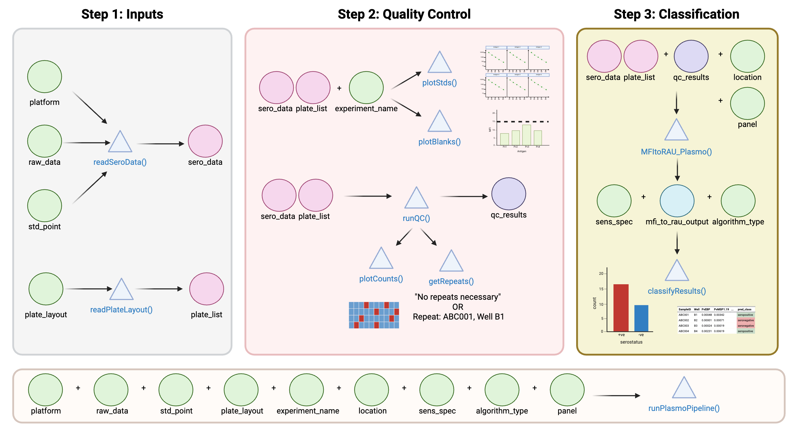

```{r, include = FALSE}
knitr::opts_chunk$set(
  collapse = TRUE,
  comment = "#>"
)
options(rmarkdown.html_vignette.check_title = FALSE)
setup <- function() {
  needed <- c("knitr", "rmarkdown", "tidyverse", "kableExtra", "purrr")
  
  lapply(needed, function(pkg) {
    if (requireNamespace(pkg, quietly = TRUE)) {
      library(pkg, character.only = TRUE)
    }
  })
}

setup()
```

For all of these analyses you can run as many plates as you wish. 

## Visualisation of the Pk/Pv/Pf Pipeline



:::{.callout-note}
### Data preparation 

Please ensure that you have read and prepared your raw Luminex files and plate layout files as per the instructions in the [Before You Begin](intro.qmd) page. 

:::

## 5-Point Standard Curve

### Step 1: Read your data

Firstly, we will be using our example data that's in-built in the package. Here replace the `system.file()` argument with the file path for your package.

```{r}
library(SeroTrackR)
library(tidyverse)

your_raw_data_5std <- c(
  system.file("extdata", "example_MAGPIX_pk_5std_plate1.csv", package = "SeroTrackR"),
  system.file("extdata", "example_MAGPIX_pk_5std_plate2.csv", package = "SeroTrackR")
)
your_plate_layout_5std <- system.file("extdata", "example_platelayout_pk_5std.xlsx", package = "SeroTrackR")
```

You can read any Luminex serology data file using the `readSeroData()` function. 

The Luminex platform can be specified using the `platform` argument, with either `bioplex`, `magpix` or `intelliflex`. 

For the xPONENT software-based exported files (MAGPIX or INTELLIFLEX), the version of the software should be specified as either **"4.2"** or **"4.3"**, with the version **"4.2"** as the default.

```{r}
pk_sero_data <- readSeroData(
  raw_data = your_raw_data_5std, 
  platform = "magpix",        # default 
  version = "4.2"             # default 
)
```

```{r}
#| exec: false
#| eval: false
pk_sero_data
```

```{r}
#| results: asis
#| echo: false

iwalk(pk_sero_data, function(df, nm) {

  cat("$", nm, "\n\n")

  tbl <- kable(df, format = "html") %>%
    kable_styling(full_width = TRUE) %>%
    scroll_box(width = "100%", height = "200px")
  print(tbl)

  cat("\n\n")
})
```

::: {.callout-tip}

#### readSeroData Output
This exports a list of data frames: 

1. `raw`: The raw, unedited files: A check that the correct file/s were added.
2. `results`: The processed serological data files: Antigen names compatible with the R package, clear columns for each antigen and their MFI results.
3. `counts`: The bead counts detected from the Luminex instrument per antigen, per sample, for each plate. 
4. `blanks`: The MFI results for the blank wells. 
5. `stds`: The MFI results for the standard curve samples.
6. `run`: The run information from the Luminex machine. 

You can access each data frame, for example the `results` data frame, like this:

```{r}
#| exec: false
#| eval: false
pk_sero_data$results
```

```{r}
#| echo: false
pk_sero_data$results %>%
  kable() %>%
  scroll_box(width = "100%", height = "200px")
```

:::

Next, you need to read in the plate layout! This file will allow us to relabel the raw luminex data from "unknowns" to our study Sample ID's. 

```{r}
pk_plate_list <- readPlateLayout(
  plate_layout = your_plate_layout_5std, 
  sero_data  = pk_sero_data
)
```

```{r}
#| exec: false
#| eval: false
pk_plate_list
```

```{r}
#| results: asis
#| echo: false

iwalk(pk_plate_list, function(df, nm) {

  cat("$", nm, "\n\n")

  tbl <- kable(df, format = "html") %>%
    kable_styling(full_width = TRUE)
  print(tbl)

  cat("\n\n")
})
```

Great! Now our serological data has been processed and our plate layouts are added into R-compatible data frames ready for analysis!

### Step 2: Quality Control checks


Quality control checks can also be run on any serological data file that has been processed using the `readSeroData()` and `readPlateLayout()` functions. The `runQC()` function will: 

1. Process bead count data (assigns a warning if bead counts are less than 15 or above 500 per antigen).
2. Assign Sample ID's to Luminex outputs.

```{r}
pk_qc_results  <- runQC(
  sero_data = pk_sero_data,       # load in your serological data variable 
  plate_list = pk_plate_list      # load your plate list variable 
)
```

::: {.callout-tip}

#### runQC Output
This exports a list of data frames: 

1. `processCounts_output``: The bead counts per antigen, per sample, for each plate. Intermediary file for downstream processing. Warning = 0 for pass and = 1 for fail. 
2. `getCounts_output`: The processed bead counts file for each sample, summarising whether a sample needs to be repeated. Intermediary file for downstream processing.
3. `sampleid_output`: Aligning the Luminex anonymised data (SampleID) to the plate layout ID's (Sample). Intermediary file for downstream processing.
4. `getAntigenCounts_output`: The processed bead counts file per antigen per sample. Used for `plotBeadCounts()`. 
5. `getCountsQC_output`: The bead counts and QC results per antigen. **Key file**. 

You can access each data frame, for example the `getCountsQC_output` data frame, like this:

```{r}
#| exec: false
#| eval: false
pk_qc_results$getCountsQC_output
```

```{r}
#| echo: false
pk_qc_results$getCountsQC_output %>%
  kable() %>%
  scroll_box(width = "100%", height = "200px")
```

:::

You can also visualise QC results using the `sero_data` and `qc_results` variables. 

#### Standard Curve Plot

The `plotStds_PkPfPv()` function plots the standard curve, generated from the antibody data from the standards you indicated in your plate layout (e.g. S1-S10) and Median Fluorescent Intensity (MFI) units are displayed in log10-adjusted scale. 

In the case of the PvSeroTAT multi-antigen panel, the antigens will be displayed and in general your standard curves should look relatively linear (only when the y-axis is on log-adjusted scale). 

```{r}
plotStds_PkPfPv(
  sero_data = pk_sero_data, 
  experiment_name = "experiment1", 
  panel = "panel1" # default 
) 
```

For more information on how to interrogate and visualise standard curves, see the [Explore Standard Curves](std_curves.qmd) page. 

:::{.callout-note}
##### Panels

The default panel is `"panel1"` which contains the following antigens: 

* *P. vivax*: LF005, LF010, LF016, EBP, RBP2b.P87, PvCSS, PTEX150, MSP8
* *P. falciparum*: PfMSP1-19, PfAMA1, Pfetramp5Ag1, PfHSP40Ag1, PfGexp18
* *P. knowlesi*: PkSSP2, PkMSP10, Pk8, PkSERA3Ag2

You can make your own panel: 

```{r}
#| exec: false
#| eval: false
new_panel <- data.frame(
  Antigens = c(
    "LF005", "LF010", "EBP", "Pfetramp5Ag1", "PfCSP", "PkSSP2"
  ), 
  Species = c(
    "Pv", "Pv", "Pv", "Pf", "Pf", "Pk"
  )
)
write.csv(new_panel, "new_panel.csv")
```

And then load it to use in your pipeline: 

```{r}
#| exec: false
#| eval: false
plotStds_PkPfPv(
  sero_data = pk_sero_data, 
  experiment_name = "experiment1", 
  panel = "new_panel.csv"
)
```

:::

#### Bead Counts QC Plot

The `plotCounts()` function provides a summary of the bead counts for each plate well are displayed, with blue indicating there are sufficient beads (≥15) or red when there are not enough. If any of the wells are red, they should be double-checked manually and re-run on a new plate if required.

```{r}
plotCounts(pk_qc_results, experiment_name = "experiment1")
```

```{r}
#| exec: false
#| eval: false
getRepeats(pk_qc_results, pk_plate_list)
```

The `getRepeats()` function will inform you whether there are "No repeats necessary" or provide a list of samples to be re-run. In the example data, the beads in plate 2 wells A1 and A2 will need to be repeated. 

```{r}
#| echo: false
getRepeats(pk_qc_results, pk_plate_list) %>%
  kable() %>%
  kable_styling(full_width = TRUE)
```

For more information on how to visualise these data, see the [Bead Counts](counts.qmd) page. 

#### Blanks QC Plot

The Median Fluorescent Intensity (MFI) units for each antigen is displayed for your blank samples. In general, each blank sample should have ≤50 MFI for each antigen, if they are higher they should be cross-checked manually.

```{r}
plotBlanks(pk_sero_data, experiment_name = "experiment1")
```

:::{.callout-info}
In the example data, blank samples recorded higher MFI values for LF005 on plate 1 and should be checked to confirm this is expected from the assay.
:::

### Step 4: MFI to RAU conversion 

The automated data processing allows you to convert your Median Fluorescent Intensity (MFI) data into Relative Antibody Units (RAU) by fitting a 5-parameter logistic function to the standard curve on a per-antigen level using the `MFItoRAU()` function suite. 

**Key input variables**:
 
- `sero_data`, `plate_list`, `qc_results`: Previously defined variables from the `readSeroData()`, `readPlateLayout()` and `runQC()` functions. 
- `panel`: Panel of Pk/Pf/Pv antigens. Default = "panel1" or user provided csv of Antigens and Species.
- `std_point`: Standard Point Curve: 5 = 5-point curve, 10 = 10-point curve. 

```{r}
#| warning: false
#| message: false
pk_mfi_to_rau_output <- MFItoRAU_Plasmo(
  sero_data = pk_sero_data, 
  plate_list = pk_plate_list,
  panel = "panel1", # default
  qc_results = pk_qc_results, 
  std_point = 5
)
```

The `mfi_to_rau_output` variable contains the processed MFI and RAU data for each antigen per sample. There are three data frames output from this variable: 

1. ``[[1]]``: Contains correct SampleID's, well number and letters, MFI and RAU values per antigen and QC results. 
1. ``[[2]]``: Contains correct SampleID's, MFI and RAU values per antigen and QC results. **Cleaner data frame!**
1. ``[[3]]``: Raw MFI to RAU conversion data per antigen. 

If you are using the `PvSeroTAT algorithm`, we need to save it into a variable to use it for classification in the next step! 

```{r}
#| exec: false
#| eval: false
pk_mfi_to_rau_output[[2]]
```

```{r}
#| echo: false
pk_mfi_to_rau_output[[2]] %>%
  kable() %>% 
  scroll_box(width = "100%", height = "200px")
```

For more information on how to visualise MFI and RAU data, see the [MFI and RAU plots](mfi_rau.qmd) page. 

### Step 4: Classification 

The `classifyResults()` function classifies samples as recently exposed within the last nine months ("seropositive") or not ("seronegative"). The `algorithm_type` chosen can be **"antibody_model"** or **"antibody_model_excLF016"**. 

:::{.callout-tip}
#### Which algorithm do I choose?
**antibody_model**: PvSeroApp Algorithm: The PvSeroApp Model contains all top 8 antigens. 

**antibody_model_excLF016**: As the name suggests, this model contains the antigens in PvSeroApp except for LF016. 
:::

The `sens_spec` can be: 

- "balanced" (default)
- "85% sensitivity"
- "90% sensitivity"
- "95% sensitivity"
- "85% specificity"
- "90% specificity"
- "95% specificity"

:::{.callout-tip}
#### Which sensitivity/specificity threshold do I use? 
The **balanced** sensitivity / specificity is when both metrics are at their highest and correspond to 81% each. 

**High sensitivity with lower specificity** maximises the identification and treatment of all likely hypnozoite carriers at the cost of some over-treatment. As radical cure carries a risk of haemolysis in G6PD-deficient individuals10 and G6PD screening can add a substantial burden to healthcare costs, operational use of a high-sensitivity, low-specificity approach is unlikely. 

**High specificity with lower sensitivity** is suited for surveillance settings and aims to correctly identify non-carriers and minimise treatment of uninfected individual, while the impact of false negatives can be mitigated by increasing survey size. 
:::

```{r}
pk_classifyResults_output <- classifyResults(
  pk_mfi_to_rau_output, 
  algorithm_type = "antibody_model", 
  sens_spec = "balanced", 
  qc_results = pk_qc_results, 
  project = "pkpfpv" # required 
)
```

The results from the classification are displayed in a table. The exposure status (seropositive/seronegative) is displayed for each sample. 

To form an educated guess about the seropositivity/exposure status for your samples, take into consideration all relevant epidemiological information that you may have available to you (e.g. time since possible exposure, timing of sampling with respect to incidence of *P. vivax* infections/cases) and explore the results using the classifier/s.

```{r}
#| exec: false 
#| eval: false
pk_classifyResults_output
```

```{r}
#| echo: false
pk_classifyResults_output %>% 
  kable() %>% 
  scroll_box(width = "100%", height = "200px")
```

For more information on how to interrogate and visualise these data, see the [Classification](classification.qmd) page. 

### Data Analysis: `runPlasmoPipeline()`

This function to (a) process raw Serological data and (b) convert MFI to RAU. The `runPlasmoPipeline()` function will output three data frames:

1. **All_Results**: All columns of every MFI to RAU conversion 
2. **MFI_RAU**: Just the SampleID, Plate, MFI and RAU values per antigen
3. **MFI_RAU_long**: SampleID, Plate, MFI, RAU, Antigen, Species (long-format df)

```{r}
results_5stdcurve <- runPlasmoPipeline(
  raw_data = your_raw_data_5std,
  platform = "magpix",
  plate_layout = your_plate_layout_5std,
  panel = "panel1",
  std_point = 5, 
  experiment_name = "5-point standard curve", 
  classify = "Yes",                 # default 
  sens_spec = "balanced",           # default 
  algorithm = "antibody_model"      # default 
)
```

#### Standard Curve Plot

```{r}
results_5stdcurve$std_curve
```

#### Bead Counts QC Plot

```{r}
results_5stdcurve$bead_counts
```

#### Blanks QC Ploat

```{r}
results_5stdcurve$blanks
```

#### MFI to RAU Tables

All results: 

```{r}
#| exec: false
#| eval: false
results_5stdcurve$mfi_outputs$All_Results
```

```{r}
#| echo: false
results_5stdcurve$mfi_outputs$All_Results %>%
  kable() %>% 
  scroll_box(width = "100%", height = "200px")
```

MFI and RAU only: 

```{r}
#| exec: false
#| eval: false
results_5stdcurve$mfi_outputs$MFI_RAU
```

```{r}
#| echo: false
results_5stdcurve$mfi_outputs$MFI_RAU %>%
  kable() %>% 
  scroll_box(width = "100%", height = "200px")
```

MFI and RAU long table: 

```{r}
#| exec: false
#| eval: false
results_5stdcurve$mfi_outputs$MFI_RAU_long
```

```{r}
#| echo: false
results_5stdcurve$mfi_outputs$MFI_RAU_long %>%
  kable() %>% 
  scroll_box(width = "100%", height = "200px")
```

Classification: 

```{r}
#| exec: false
#| eval: false
results_5stdcurve$pv_classification
```

```{r}
#| echo: false
results_5stdcurve$pv_classification %>%
  kable() %>% 
  scroll_box(width = "100%", height = "200px")
```

### No Classification 

You can run the `runPlasmoPipeline()` without classification using the following: 

```{r}
runPlasmoPipeline(
  raw_data = your_raw_data_5std,
  platform = "magpix",
  plate_layout = your_plate_layout_5std,
  panel = "panel1",
  std_point = 5, 
  experiment_name = "5-point standard curve", 
  classify = "No"
)
```

## 10-Point Standard Curve

These steps are very similar to the 5-point standard curve, except where indicated. This tutorial focusses exclusively on the `runPlasmoPipeline()` but applies to every step mentioned above. 

### Step 1: Load your data!

```{r}
your_raw_data_10std <- c(
  system.file("extdata", "example_MAGPIX_pk_10std_plate1.csv", package = "SeroTrackR"),
  system.file("extdata", "example_MAGPIX_pk_10std_plate2.csv", package = "SeroTrackR")
)
your_plate_layout_10std <- system.file("extdata", "example_platelayout_pk_10std.xlsx", package = "SeroTrackR")
```

### Step 2: Read your data and process MFI to RAU

```{r}
results_10stdcurve <- runPlasmoPipeline(
  raw_data = your_raw_data_10std,
  platform = "magpix",
  plate_layout = your_plate_layout_10std,
  panel = "panel1",
  std_point = 10, # here make sure you write 10! 
  experiment_name = "10-point standard curve",
  classify = "Yes",                 # default 
  sens_spec = "balanced",           # default 
  algorithm = "antibody_model"      # default 
)
```

#### Standard Curve Plot

```{r}
results_10stdcurve$std_curve
```

#### Bead Counts QC Plot

```{r}
results_10stdcurve$bead_counts
```

#### Blanks QC Ploat

```{r}
results_10stdcurve$blanks
```

#### MFI to RAU Tables

All results: 

```{r}
#| exec: false
#| eval: false
results_10stdcurve$mfi_outputs$All_Results
```

```{r}
#| echo: false
results_10stdcurve$mfi_outputs$All_Results %>%
  kable() %>% 
  scroll_box(width = "100%", height = "200px")
```

MFI and RAU only: 

```{r}
#| exec: false
#| eval: false
results_10stdcurve$mfi_outputs$MFI_RAU
```

```{r}
#| echo: false
results_10stdcurve$mfi_outputs$MFI_RAU %>%
  kable() %>% 
  scroll_box(width = "100%", height = "200px")
```

MFI and RAU long table: 

```{r}
#| exec: false
#| eval: false
results_10stdcurve$mfi_outputs$MFI_RAU_long
```

```{r}
#| echo: false
results_10stdcurve$mfi_outputs$MFI_RAU_long %>%
  kable() %>% 
  scroll_box(width = "100%", height = "200px")
```

Classification: 

```{r}
#| exec: false
#| eval: false
results_10stdcurve$pv_classification
```

```{r}
#| echo: false
results_10stdcurve$pv_classification %>%
  kable() %>% 
  scroll_box(width = "100%", height = "200px")
```