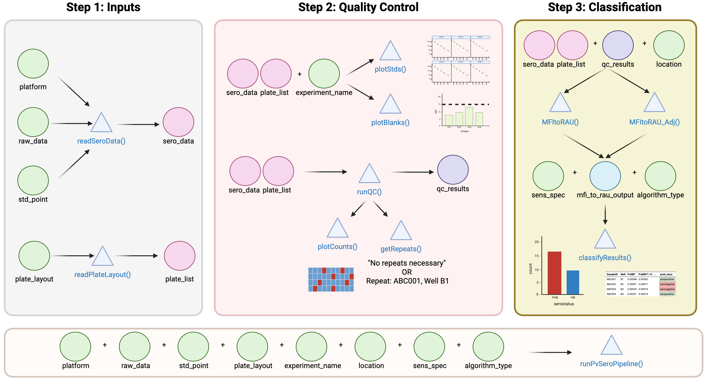

```{r, include = FALSE}
knitr::opts_chunk$set(
  collapse = TRUE,
  comment = "#>"
)
options(rmarkdown.html_vignette.check_title = FALSE)
setup <- function() {
  needed <- c("knitr", "rmarkdown", "tidyverse", "kableExtra", "purrr")
  
  lapply(needed, function(pkg) {
    if (requireNamespace(pkg, quietly = TRUE)) {
      library(pkg, character.only = TRUE)
    }
  })
}

setup()
library(SeroTrackR)
```

## Data Analysis: function by function 

We can also run the functions within the `runPvSeroPipeline()` to identify each step independently. This can be useful particularly when modifying graphs or saving files and interrogating the data. 

### Visualisation of the PvSeroApp Pipeline



### Using Tutorial Dataset: Load the Data

We will be using the build-in files in the R package for this tutorial, as shown here: 

```{r setup 1}
library(SeroTrackR)
library(tidyverse)

your_raw_data <- c(
  system.file("extdata", "example_MAGPIX_plate1.csv", package = "SeroTrackR"),
  system.file("extdata", "example_MAGPIX_plate2.csv", package = "SeroTrackR"), 
  system.file("extdata", "example_MAGPIX_plate3.csv", package = "SeroTrackR")
)
your_plate_layout <- system.file("extdata", "example_platelayout_1.xlsx", package = "SeroTrackR")
```

To run your OWN data, follow the code here, replacing PATH/TO/YOUR/FILE with your file path: 

```{r}
#| exec: false
#| eval: false 
your_raw_data <- c(
  "PATH/TO/YOUR/FILE/plate1.csv",
  "PATH/TO/YOUR/FILE/plate2.csv",
  "PATH/TO/YOUR/FILE/plate3.csv"
)
your_plate_layout <- "PATH/TO/YOUR/FILE/plate_layout.xlsx"
```

:::{.callout-note}
#### Data preparation 

Please ensure that you have read and prepared your raw Luminex files and plate layout files as per the instructions in the [Before You Begin](intro.qmd) page. 

:::

### Step 1: Read in the raw data 

You can read any Luminex serology data file using the `readSeroData()` function. 

The Luminex platform can be specified using the `platform` argument, with either `bioplex`, `magpix` or `intelliflex`. 

For the xPONENT software-based exported files (MAGPIX or INTELLIFLEX), the version of the software should be specified as either **"4.2"** or **"4.3"**, with the version **"4.2"** as the default.

```{r}
sero_data <- readSeroData(
  raw_data = your_raw_data, 
  platform = "magpix",        # default 
  version = "4.2"             # default 
)
```

```{r}
#| exec: false
#| eval: false
sero_data
```

```{r}
#| results: asis
#| echo: false

iwalk(sero_data, function(df, nm) {

  cat("$", nm, "\n\n")

  tbl <- kable(df, format = "html") %>%
    kable_styling(full_width = TRUE) %>%
    scroll_box(width = "100%", height = "200px")
  print(tbl)

  cat("\n\n")
})
```

::: {.callout-tip}

#### readSeroData Output
This exports a list of data frames: 

1. `raw`: The raw, unedited files: A check that the correct file/s were added.
2. `results`: The processed serological data files: Antigen names compatible with the R package, clear columns for each antigen and their MFI results.
3. `counts`: The bead counts detected from the Luminex instrument per antigen, per sample, for each plate. 
4. `blanks`: The MFI results for the blank wells. 
5. `stds`: The MFI results for the standard curve samples.
6. `run`: The run information from the Luminex machine. 

You can access each data frame, for example the `results` data frame, like this:

```{r}
#| exec: false
#| eval: false
sero_data$results
```

```{r}
#| echo: false
sero_data$results %>%
  kable() %>%
  scroll_box(width = "100%", height = "200px")
```

:::

Next, you need to read in the plate layout! This file will allow us to relabel the raw luminex data from "unknowns" to our study Sample ID's. 

```{r}
plate_list <- readPlateLayout(
  plate_layout = your_plate_layout, 
  sero_data  = sero_data
)
```

```{r}
#| exec: false
#| eval: false
plate_list
```

<!-- ```{r} -->
<!-- #| results: asis -->
<!-- #| echo: false -->

<!-- library(purrr) -->
<!-- library(knitr) -->
<!-- library(kableExtra) -->

<!-- iwalk(plate_list, ~{ -->
<!--   cat(.y, "\n\n") -->
<!--   cat( -->
<!--     kable(.x, format = "html") -->
<!--   ) -->
<!--   cat("\n\n") -->
<!-- }) -->
<!-- ``` -->

```{r}
#| results: asis
#| echo: false

iwalk(plate_list, function(df, nm) {

  cat("$", nm, "\n\n")

  tbl <- kable(df, format = "html") %>%
    kable_styling(full_width = TRUE)
  print(tbl)

  cat("\n\n")
})
```

Great! Now our serological data has been processed and our plate layouts are added into R-compatible data frames ready for analysis! 

### Step 2: Quality control checks

```{r}
qc_results  <- runQC(
  sero_data = sero_data, 
  plate_list = plate_list
)
```


```{r}
stdcurve_plot             <- plotStds(sero_data, location = "PNG", experiment_name = "experiment1")
plateqc_plot              <- plotCounts(qc_results, experiment_name = "experiment1")
check_repeats_output      <- getRepeats(qc_results, plate_list)
blanks_plot               <- plotBlanks(sero_data, experiment_name = "experiment1")
```

### Step 3: MFI to RAU conversion 

If location == png or if you are not using the Pv classification 

```{r}
mfi_to_rau_output       <- suppressWarnings(MFItoRAU(sero_data, plate_list, qc_results, std_point = 10, project = NULL))
model_plot              <- plotModel(mfi_to_rau_output, sero_data)
```

if location == eth 

```{r}
mfi_to_rau_output       <- suppressMessages(MFItoRAU_Adj(sero_data, plate_list, qc_results, std_point = 10, project = NULL))
model_plot              <- plotModel_Adj(mfi_to_rau_output, sero_data)
```

### Step 4: Classification 

```{r}
classifyResults_output    <- classifyResults(mfi_to_rau_output, algorithm_type = "antibody_model", sens_spec = "balanced", qc_results, project = NULL)
```

## Data Analysis: `runPvSeroPipeline()` 

Run this global function `runPvSeroPipeline()` embedded within the `{SeroTrackR}` R package! This function contains all of the steps in order of how to perform the *Plasmodium vivax* serology test and treat protocol as found in our [application](https://dionnecargy.shinyapps.io/PvSeroApp/)! 

### Run Classification: Yes

```{r runPvSeroPipeline with classification}
final_analysis <- runPvSeroPipeline(
  raw_data = your_raw_data, 
  plate_layout = your_plate_layout, 
  platform = "magpix", 
  location = "ETH", 
  experiment_name = "experiment1", 
  std_point = 10,
  classify = "Yes", 
  algorithm_type = "antibody_model", 
  sens_spec = "balanced"
)
```

#### Classification 

This is a table containing the classification results (seropositive or seronegative) for each `SampleID`. In this case, the classification results are stored in the `pred_class_max` column as we chose the `sens_spec = "balanced"`. If you change it to another type of threshold, then the suffix of that column will change accordingly. 

You will also see the relative antibody unit (RAU) values (columns with antigen names), whether the sample passed QC check (`QC_total`) and the `plate` that they were run on. 

```{r classification tab 1}
final_analysis[[1]] %>%
  head() %>% 
  kable()
```

#### Standard Curve Plot

The standard curve plots are generated from the antibody data from the standards you indicated in your plate layout (e.g. S1-S10) and Median Fluorescent Intensity (MFI) units are displayed in log10-scale. In the case of the PvSeroTaT multi-antigen panel, the antigens will be displayed and in general your standard curves should look relatively linear (only when the y-axis is on logarithmic scale). 

```{r std curve plot tab 1}
final_analysis[[2]]
```

#### Bead Counts QC Plot

A summary of the bead counts for each plate well are displayed, with blue indicating there are sufficient beads (≥15) or red when there are not enough. If any of the wells are red, they should be double-checked manually and re-run on a new plate if required.

The function will inform you whether there are "No repeats necessary" or provide a list of samples to be re-run. In the example data, the beads in plate 2 wells A1 and A2 will need to be repeated

```{r bead counts plot tab 1}
final_analysis[[3]] # Plot
final_analysis[[4]] # Samples to repeat 
```

#### Blanks QC Plot

The Median Fluorescent Intensity (MFI) units for each antigen is displayed for your blank samples. In general, each blank sample should have ≤50 MFI for each antigen, if they are higher they should be cross-checked manually.

In the example data, blank samples recorded higher MFI values for LF005 on plate 1 and should be checked to confirm this is expected from the assay.

```{r blanks qc plot tab 1}
final_analysis[[5]]
```

#### Model Output Plot

The automated data processing in this app allows you to convert your Median Fluorescent Intensity (MFI) data into Relative Antibody Units (RAU) by fitting a 5-parameter logistic function to the standard curve on a per-antigen level. The results from this log-log conversion should look relatively linear for each antigen.

```{r model output plot tab 1}
final_analysis[[6]]
```

### Run Classification: No

```{r runPvSeroPipeline without classification}
no_classification_final_analysis <- runPvSeroPipeline(
  raw_data = your_raw_data, 
  plate_layout = your_plate_layout, 
  platform = "magpix", 
  location = "ETH", 
  experiment_name = "experiment1", 
  std_point = 10,
  classify = "No", # key if you do NOT want any classification performed i.e., you do not have PvSeroTaT antigens 
  algorithm_type = "antibody_model", 
  sens_spec = "balanced"
)
```


#### MFI and RAU Data 

```{r mfi and rau tab 2}
no_classification_final_analysis[[1]]  %>%
  head() %>% 
  kable()
```

#### QC Plots

Repeat the same steps as above to find the QC plots! 

```{r std curve plot tab 2}
#### Standard Curve Plot
no_classification_final_analysis[[2]]

#### Bead Counts QC Plot
no_classification_final_analysis[[3]] # Plot
no_classification_final_analysis[[4]] # Samples to repeat 

#### Blanks QC Plot
no_classification_final_analysis[[5]]

#### Model Output Plot
no_classification_final_analysis[[6]]
```

### Create a PDF Report

```{r create pdf output, exec=FALSE, eval=FALSE}
renderQCReport(
  your_raw_data, 
  your_plate_layout, 
  "magpix", 
  location = "ETH",
  path = "results/" # defaults to your current working directory
)
```
